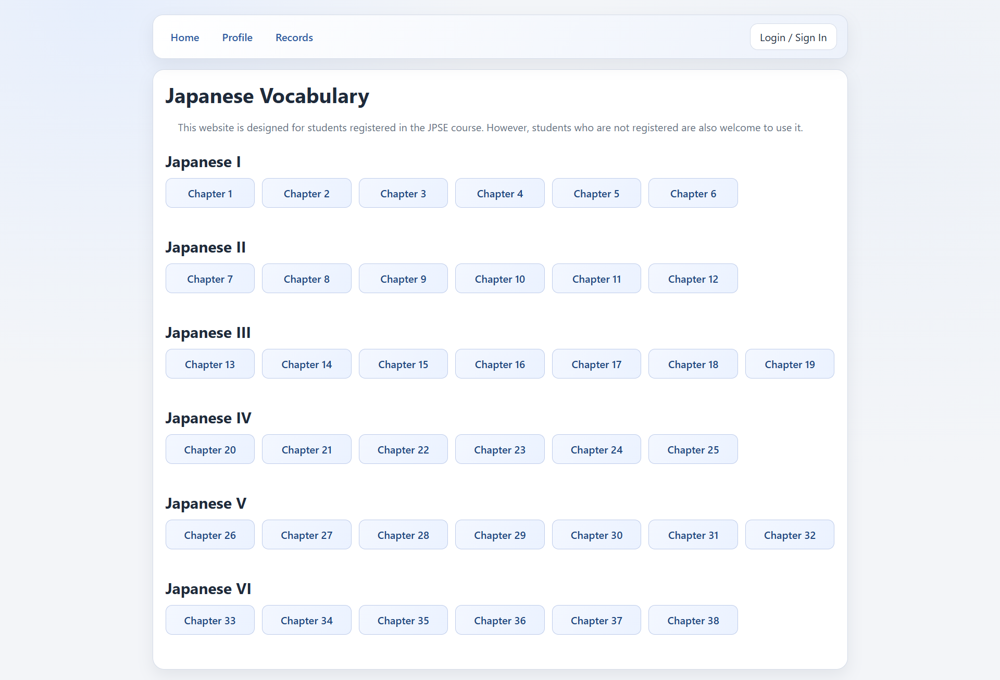
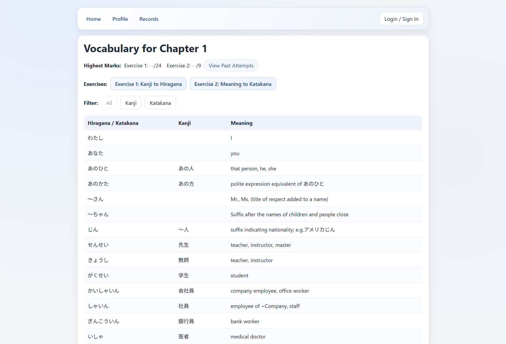
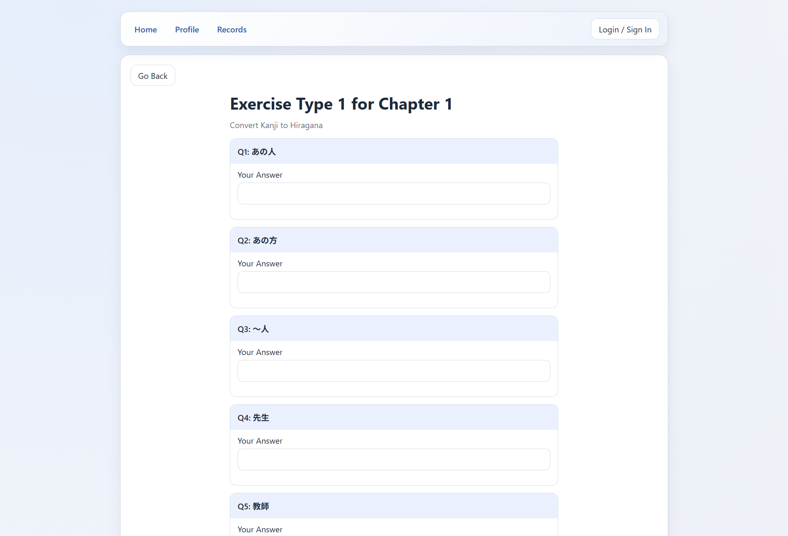
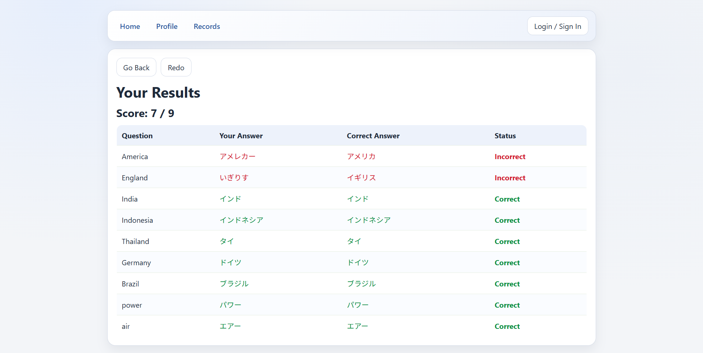
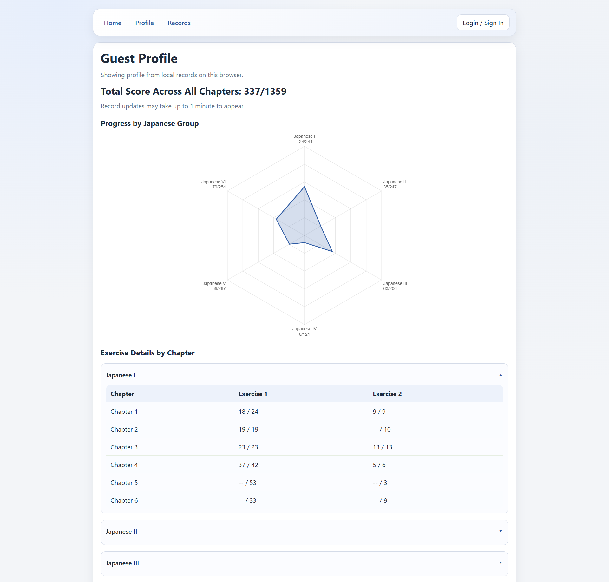

# Japanese Vocabulary Web

Japanese vocabulary learning website designed for JPSE students, built with React, Vite, Firebase Auth, and Firestore. [Click Here](https://jpse-vocab.web.app) to visit the website.

## Screenshots
**Home & Chapter Page:** There are 38 chapters in total, grouped into 6 levels. Users can review vocabulary by chapter.
-  

**Exercise & Results Page:** Users can do exercises and check their answers.
-  

**Profile page:** The attempts of each exercise will be saved into their profile. Users can use visit their profile with or without signing in.
- For logged-in user: records are saved to the user account
- For logged-in user user: records are saved in local browser storage

If a user later log in, local records are synced to the account.
- 

## Tech Stack

- React 18
- Vite 8
- React Router 6
- Firebase Auth
- Firestore
- Chart.js + react-chartjs-2

## Local Setup

1. Install dependencies and run development server.
2. Create `.env` from `.env.example` and fill in all `VITE_FIREBASE_*` values.
3. Use hostnames (not full URLs) for Firebase domains:
	- `VITE_FIREBASE_AUTH_DOMAIN=your-project.firebaseapp.com`
	- `VITE_FIREBASE_STORAGE_BUCKET=your-project.appspot.com` (or the bucket shown in your Firebase console)
4. In Firebase Console:
	- Enable `Authentication > Sign-in method > Google`.
	- Add your dev and deploy domains in `Authentication > Settings > Authorized domains` (for example: `localhost`, `127.0.0.1`, and your hosting domain).

If login shows `400` from `identitytoolkit` or `404` from `__/auth`, verify the API key, auth domain, and authorized domains first.

## Data Sources and Cost Strategy

The app serves chapter content from static JSON to reduce Firestore reads. Firestore is mainly used for user-specific data:
- authentication state
- exercise records
- user profile

The catche data from static JSON will be refreshed after a certain period:
- Chapter metadata and vocab cache: per 24 hours
- User best summary cache: per 1 minute
- User records cache: per 5 minutes

## References
Based on the vocabulary from the textbooks Minna no Nihongo. Assets are used for non-commercial purpose.